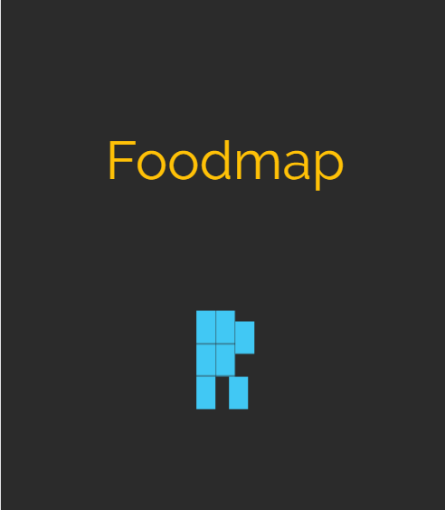
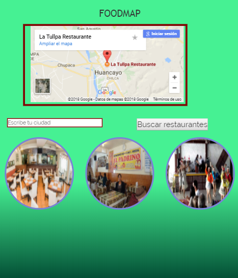
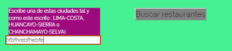
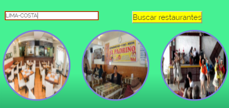
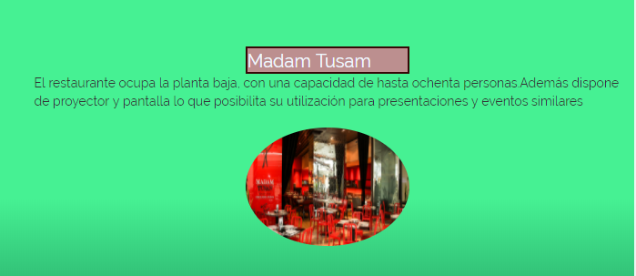
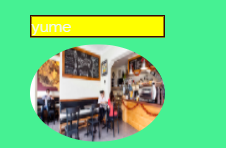
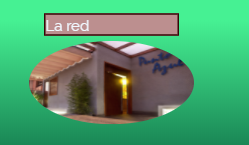
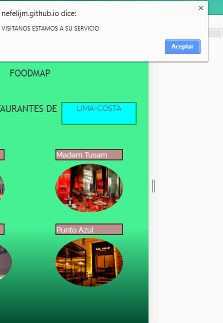
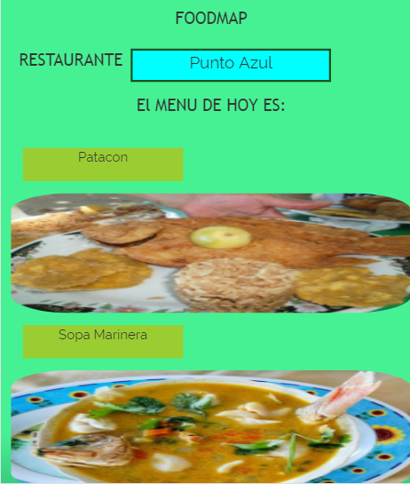
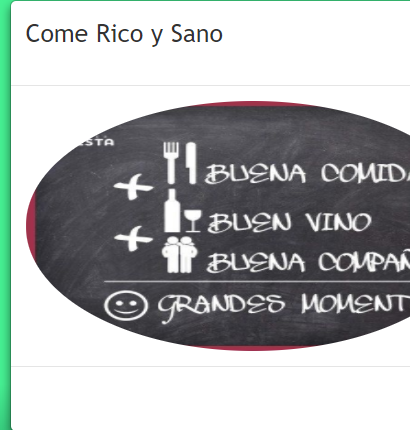

*FOODMAP
Nefeli Joñoruco Morales

**OBJETIVO
Crea una web-app que a través de un input pueda filtrar los restaurantes que se encuentran cerca de ti.

**FUNCIONALIDAD DE LAS VISTAS
1.Vista splash con duración de 2 a 5 segundos que redirecciona a tu vista principal

;
_____________________________________________________________________________________________________________________

2.En la siguiente vista se mostrara un input donde podras seleccionar la ciudad que deseas

;
_____________________________________________________________________________________________________________________

3.Es necesario que se escriba la ciudad del mismo modo que se muestra en el mensaje

;
_____________________________________________________________________________________________________________________

4.Una vez ingresado La ciudad se activara el boton mostrandose de color amarillo

;
_____________________________________________________________________________________________________________________

5.En la vista de restaurantes se mostrara los  diferentes mouseover que se aplico en las imagenes
;

;

;

;
_____________________________________________________________________________________________________________________
6.Una vez que hagues click en el nombre del restaurante aparecera las listas de platos que tenemos
;
_____________________________________________________________________________________________________________________
7.Cuando elegimos el plato nos sale un modal

